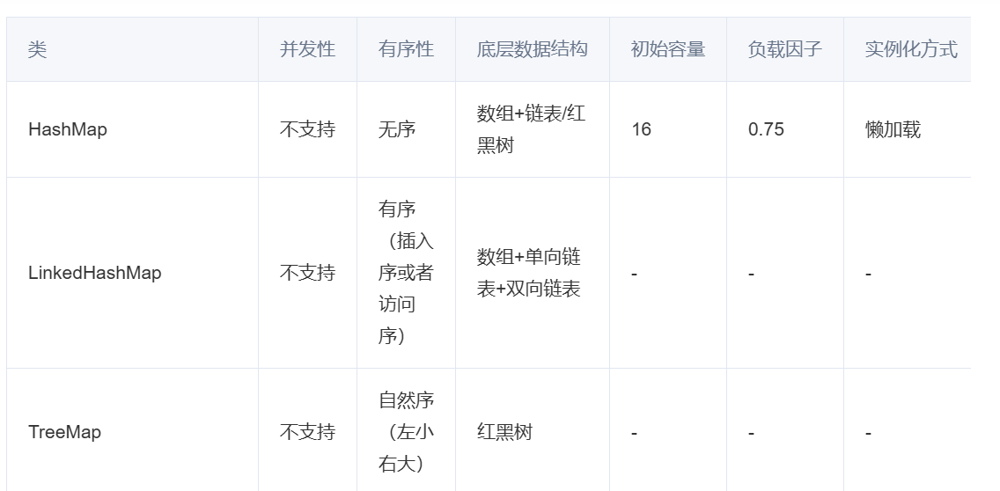
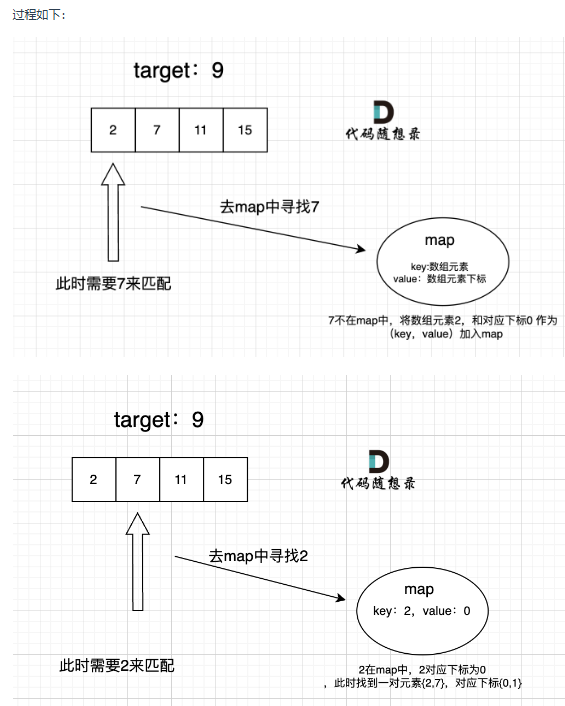

# Arithmetic

### Introductions

该仓库记录的是通过学校/网络学习到的算法。多数算法题及相关出自力扣（大概）。旨在练习并记录一些基本的算法。
 另：未特别注明的算法代码用的为核心代码模式，特别注明为ACM模式的即为ACM模式。

### Development Environments

- **Idea**

- **Git**

- **JDK21**

### Finding, Thinking And Doing

1. leeCode上的程序执行逻辑好像和idea上的不大一样，
比如`for(int i = left; i <= right; i++){}`,
当left和right相等时，idea会再执行一遍for的内容，
但是leeCode的程序就不会再执行for了。(所以如果在自己的程序里面运行正确但是在leeCode上提交代码发现错误时可以看看是不是因为这个原因。)

2. leeCode上的内存消耗测试是不准的。两次同样的代码测试过后内存消耗都可能天差地别。
(但是不知道时间消耗准不准)

3. 大概从九月三号的代码开始，就不再是将题粘来idea做了。打算走出idea的舒适圈，
不依靠idea的自动代码提示，而是直接在力扣上写题，习惯一下力扣的核心代码模式。不过，写成功之后依然会建立相应文件来装题目，代码，心得，运行结果等。

4. 大概从九月四号开始，会在update加上自己的简略解题思路！但是也推荐直接点开详细代码！里面直接记录了
思考的方向等更加具体的解题过程，如果时间多的话，重看的时候应该会很有意思的吧(o゜▽゜)o☆

### Update

#### 2024/9/8
1. 收录代码[赎金信](src/main/java/com/example/programmercarl/hash_table/ransom_letter/RansomLetter.java)(leeCode 383) 

   执行用时分布
   71
   ms
   击败
   5.34%
   复杂度分析
   消耗内存分布
   46.16
   MB
   击败
   5.01% 
   
   大致思路就是，用字符当数组（数组用来统计数量）下标，一增一减，减成负数就说明肯定是少了。 
   
   这道题和前面一道题几乎一模一样，这个方法也和那道题的题解思想差不多，按道理来说数据不会差才对， 
   但是没想到复杂度则么高。难道还有更好的方法？ 

   看了一下题解。确实方法是一样的，好吧那看来就是这样啦。因为写得差不多，所以题解就不再记录了。

#### 2024/9/7

1. 收录代码[四数相加为零(失败)](src/main/java/com/example/programmercarl/hash_table/the_sum_of_four_numbers/TheSumOfFourNumbers.java)(leeCode 454)(暴力)
   低估这道题了。以为它是上一题的变式或者深入，但是发现我无法解决储存两个数并去重这个问题。
   我的思路是这样的，打算纯暴力， 
   
   先用map记录下前两个数组各种和的组合，然后再创建一个set，用map.contains() 
   
   函数检验另两个数组的各种和的倒数的组合，若在map中存在，则放入set中。这样我就可以得到了
   满足条件的两数相加等于另两数相加的倒数中的加值。 
   这时候再分开看前两个数组有哪些不重复的组合的加值等于目标加值，既mul。

   下半同理，多个mul相加既得出答案。但是找不到合适的数据结构来记录这两个数（如数组1，2的某值）并实现去重。 
   
   试过利用set创了个set<int[]>的结构，结果用了才发现set中的数组是不能去重的，查了一下说是如果想要去重set中的对象等结构的话就要自己重写
   对应方法了(悲)。然后试着用二维数组int[][] 结果提示错误知道了java中负数不能作下标...... 

   这道题想得够久了，而且方法还是暴力，再继续下去也没意义了，看题解吧(T_T) 

   [题解](src/main/java/com/example/programmercarl/hash_table/the_sum_of_four_numbers/Improve.java) 

   它好简单，我好心碎(T_T)
   
   

#### 2024/9/6

1. 收录代码[两数之和](src/main/java/com/example/programmercarl/hash_table/the_sum_of_two_numbers/TheSumOfTwoNumbers.java)(leeCode 1)(前后指针法) 
   值得一提的是，这个题之前做过收录过，是第二次写的算法题吧，当时没学啥算法，就直接[暴力解决](src/main/java/com/example/school/addtwonumberstogether/AddTwoNumbersTogether.java)了。  
   结果：执行用时分布
   54
   ms
   击败
   20.57%
   复杂度分析
   消耗内存分布
   43.94
   MB
   击败
   41.93%   
   这次写则想试试用其他方法， 
   思路如下：只使用一个while(),用前后指针法。p在后，q在前跑，`nums[p] + nums[q] == target`则记录下p，q，它们则是答案。 
   当`q == length`则p往前走一步，q再在p前面跑，一直循环直到p到达尽头。
   感觉思路还是很清晰的。 

   结果：
   执行用时分布
   59
   ms
   击败
   7.58%
   复杂度分析
   消耗内存分布
   43.75
   MB
   击败
   80.75% 

   收录[优秀题解](src/main/java/com/example/programmercarl/hash_table/the_sum_of_two_numbers/Improve.java) 题解这里是使用map来解决的。 
   另：题解中map的key储存的是数组中值，value储存的是数组的下标。 以下是常见一点的map(java)
   
   过程图如下: 
    [更详细的分析过程在此](src/main/java/com/example/programmercarl/hash_table/the_sum_of_two_numbers/improve_solution.md)。 

   执行用时分布
   2
   ms
   击败
   99.61%
   复杂度分析
   消耗内存分布
   44.02
   MB
   击败
   27.19% 
   可以看出来提升是非常大的。
#### 2024/9/4
1. 收录代码[快乐数](src/main/java/com/example/programmercarl/hash_table/happy_numbers/HappyNumbers.java)(leeCode 202) 
   思路：整一个set记录计算后的数，如果过程中数为1则return ture;反之则丢在set中
    
   如果计算中和set中的值重复则非快乐数返回false 
   （set真好用,嘿嘿） 
   执行用时分布
   1
   ms
   击败
   81.14%
   复杂度分析
   消耗内存分布
   39.79
   MB
   击败
   69.84% 
   看了一下题解，方法过程啥的都差不多一毛一样啊（不过也是因为这道题实在是过于简单了（￣︶￣））
   所以题解略啦哈哈哈。

#### 2024/9/3
1. 收录代码[两个数组的交集](src/main/java/com/example/programmercarl/hash_table/the_intersection_of_two_arrays/TheIntersectionOfTwoArrays.java)(leeCode 349) 
   执行用时分布
   3
   ms
   击败
   49.90%
   复杂度分析
   消耗内存分布
   43.73
   MB
   击败
   5.00% 
   想在最后把set直接转成数组，但是搜索了很久，都没有找到可靠有用的方法。
    
   所以最后是额外建了一个数组来装set的遍历的内容。
    收录[较好题解](src/main/java/com/example/programmercarl/hash_table/the_intersection_of_two_arrays/Improve.java)(set转数组)
    
   执行用时分布
   4
   ms
   击败
   31.93%
   复杂度分析
   消耗内存分布
   42.48
   MB
   击败
   30.00% 
   题解所用的思路和我的可谓是一模一样。但是惊喜之处是题解给出了将set
   转数组的方法。感觉是非常有用的，而且之后肯定也会有大用处（有很大的预感，这个方法可以成为这个章节的主角之一）。 
   

2. 更新了一下idea，将其整到2024年版，并且把jdk整成了21版。
#### 2024/8/27
1. 收录代码[有效的字母异位词](src/main/java/com/example/programmercarl/hash_table/valid_letter_scrambles/ValidLetterScrambles.java)(leeCode 242) 
   执行用时分布
   5
   ms
   击败
   34.13%
   复杂度分析
   消耗内存分布
   42.24
   MB
   击败
   46.57%  
   收录[较好题解](src/main/java/com/example/programmercarl/hash_table/valid_letter_scrambles/Improve.java)
#### 2024/8/23
1. 收录代码[环形链表](src/main/java/com/example/programmercarl/chain_table/circular_linked_list/CircularLinkedList.java)(leeCode 142.环形链表Ⅱ) 
   执行用时分布
   141
   ms
   击败
   2.93%
   复杂度分析
   消耗内存分布
   43.46
   MB
   击败
   70.57% 
   想了好久，终于是结合多方面的思考找到了突破口，不过用了两个while循环，果然数据不会太好看(-_-)。 
   我的思路是：q在前面跑，p在头节点处不动，计算
   p和q的距离。按道理来说应该是一直增大的，缩小就说明有环了。 
    
   [较好题解](src/main/java/com/example/programmercarl/chain_table/circular_linked_list/OtherSolution.java)的思路是：用快慢指针法——分别定义 fast 和 slow 指针，从头结点出发，fast指针每次移动两个节点， 
   slow指针每次移动一个节点，如果 fast 和 slow指针在途中相遇 ，说明这个链表有环。 
   另：在后面，fast一直都在环上移动了,所以后面两指针相遇也肯定在环上。 
   根据数量关系计算(画图然后各种计算关系)，可以得出: 
   从头结点出发一个指针，从相遇节点 也出发一个指针，这两个指针每次只走一个节点，  
   那么当这两个指针相遇的时候就是 环形入口的节点。
2. 自此，链表的针对性练习就告一段落了，[总结在此~](src/main/java/com/example/programmercarl/chain_table/summary.md)
   
   

#### 2024/8/14
1. 收录代码[找链表相交的节点](src/main/java/com/example/programmercarl/chain_table/intersection_of_linked_list/Intersection.java)(leeCode 面试题 02.07. 链表相交) 
   执行用时分布
   1
   ms
   击败
   99.97%
   复杂度分析
   消耗内存分布
   47.37
   MB
   击败
   75.08% 
   这里的思路是:从后往前找，因为如果有相交节点的话，两条链表的最后的节点肯定相等。 
   一直往前找相等的节点，直到节点不再相等，那么最后一个相等的节点就是两条链表的相交节点。  
   查看题解时可以发现还有[另一种思路](src/main/java/com/example/programmercarl/chain_table/intersection_of_linked_list/OtherSolution.java)：  
   先算出两个链表的长度，然后再计算差值，将两个链表对齐再一个节点一个节点从前往后比较， 
   找到相等的节点，既相交节点。 
   这个思路也挺好，而且实现也很简单。故做此纪录。 
   若用该方法: 
   执行用时分布
   1
   ms
   击败
   99.97%
   复杂度分析
   消耗内存分布
   47.31
   MB
   击败
   80.56%

   
   
   
#### 2024/8/11 
1. 收录代码[相邻节点两两交换](src/main/java/com/example/programmercarl/chain_table/exchange_one_by_one/Exchange.java)(leeCode 24) 
   执行用时分布
   0
   ms
   击败
   100.00%
   复杂度分析
   消耗内存分布
   40.23
   MB
   击败
   64.22% 
   较优题解与我所写的方法一致，既不过多赘述  
2. 收录代码[删除倒数第n个节点](src/main/java/com/example/programmercarl/chain_table/delete_the_nth_last_node/Delete.java)(leeCode 19) 
   执行用时分布
   0
   ms
   击败
   100.00%
   复杂度分析
   消耗内存分布
   40.56
   MB
   击败
   95.22%
   
#### 2024/8/9

1. 收录代码[设计链表](src/main/java/com/example/programmercarl/chain_table/design_linked_list/MyLinkedList.java)(leeCode 707) 
   执行用时分布
   12
   ms
   击败
   6.80%
   复杂度分析
   消耗内存分布
   44.22
   MB
   击败
   98.08%
     
   根据较好题解[重写](src/main/java/com/example/programmercarl/chain_table/design_linked_list/MyLinkedListImprove.java)（其实都差不多啊，链表这边的基础题很难玩出花来。差不多一个写法。题解中还有更快的，但是直接用了java里的自带库，感觉算是钻了空子，对该题来说没有意义。便不多记录。） 
   执行用时分布
   10
   ms
   击败
   32.41%
   复杂度分析
   消耗内存分布
   44.51
   MB
   击败
   29.68%  
2. 收录[反转链表](src/main/java/com/example/programmercarl/chain_table/reverse_linked_list/Reverse.java)(leeCode 206) 
   执行用时分布
   0
   ms
   击败
   100.00%
   复杂度分析
   消耗内存分布
   41.48
   MB
   击败
   28.91%  
   根据较好题解[改写代码](src/main/java/com/example/programmercarl/chain_table/reverse_linked_list/Improve.java)（方法一样，提高一下代码可读性）
   执行用时分布
   0
   ms
   击败
   100.00%
   复杂度分析
   消耗内存分布
   41.33
   MB
   击败
   77.84%  
   用[递归](src/main/java/com/example/programmercarl/chain_table/reverse_linked_list/ImproveRecursion.java)写一下：
   执行用时分布
   0
   ms
   击败
   100.00%
   复杂度分析
   消耗内存分布
   41.39
   MB
   击败
   63.17%

   
#### 2024/8/7

1. 收录[移除链表](src/main/java/com/example/programmercarl/chain_table/remove_linked_list_element/RemoveElement.java)(leeCode 203) 
   执行用时分布
   1
   ms
   击败
   59.69%
   复杂度分析
   消耗内存分布
   44.32
   MB
   击败
   82.59%
   [题解代码](src/main/java/com/example/programmercarl/chain_table/remove_linked_list_element/Improve.java)差不多，就不过多赘述。

#### 2024/8/6
1. 收录题[开发商买土地](src/main/java/com/example/programmercarl/arrary/the_developer_buys_land/DeveloperBuysLand.java)(ACM模式)(KamaCoder 44) 
   (前缀和)
   答案正确
   运行时间：
   2104ms
   消耗内存：
   25700kb  
   根据较好题解重写代码([也是前缀和，但是多用现成的Math函数简化了计算，增加了代码的可读性](src/main/java/com/example/programmercarl/arrary/the_developer_buys_land/Improve.java)) 
   本次提交
   答案正确
   运行时间：
   2271ms
   消耗内存：
   29008kb
2. 自此，数组的题的相关针对性练习就告一段落了，[总结在此~](src/main/java/com/example/programmercarl/arrary/summary.md)

#### 2024/8/5
1. 收录题[区间和](src/main/java/com/example/programmercarl/arrary/sum_of_intervals/SumOfIntervals.java)(ACM模式)(KamaCoder 58) 
   (暴力)超时
     
   根据较好题解重写代码([前缀和](src/main/java/com/example/programmercarl/arrary/sum_of_intervals/Improve.java))(该题特意卡的暴力，目的是引出前缀和) 
   本次提交
   答案正确
   运行时间：
   1584ms
   消耗内存：
   58464kb

#### 2024/8/4

1. 收录题[螺旋矩阵](src/main/java/com/example/programmercarl/arrary/spiral_matrix/SpiralMatrix.java)(leeCode 59) 
   执行用时分布
   0
   ms
   击败
   100.00%
   复杂度分析
   消耗内存分布
   40.30
   MB
   击败
   93.65%  
    根据较好题解[重写代码](src/main/java/com/example/programmercarl/arrary/spiral_matrix/Improve.java)(该题考的是思维，题解的基本思想和我写的一致，但是思路更简洁易懂，可读性大大增强) 
   执行用时分布
   0
   ms
   击败
   100.00%
   复杂度分析
   消耗内存分布
   40.30
   MB
   击败
   92.36%

#### 2024/8/2

1. 收录题[长度最小的子数组](src/main/java/com/example/programmercarl/arrary/smallest_length_subarray/Smallest.java)(leeCode 209) 
   根据较好题解[重写代码](src/main/java/com/example/programmercarl/arrary/smallest_length_subarray/Improve.java)(滑动窗口法)(improve)  
   执行用时分布
   1
   ms
   击败
   99.80%
   复杂度分析
   消耗内存分布
   56.77
   MB
   击败
   28.54%

#### 2024/8/1

1. 收录题[原地移除元素](src/main/java/com/example/programmercarl/arrary/remove_element/RemoveElement.java)(leeCode num.27) 
   执行用时分布
   0
   ms
   击败
   100.00%

   消耗内存分布
   41.00
   MB
   击败
   45.27%  
   根据较好题解[重写代码](src/main/java/com/example/programmercarl/arrary/remove_element/Improve.java)(左右指针法)(improve) 
   执行用时分布
   0
   ms
   击败
   100.00%
   
   消耗内存分布
   41.00
   MB
   击败
   45.27%
2. 收录题[有序数组的平方](src/main/java/com/example/programmercarl/arrary/square_of_an_ordered_array/Square.java)(leeCode num.977) 
   执行用时分布
   5
   ms
   击败
   21.97%
   复杂度分析
   消耗内存分布
   45.49
   MB
   击败
   89.68%  
根据较好题解[重写代码](src/main/java/com/example/programmercarl/arrary/square_of_an_ordered_array/Improve.java)，将时间复杂度减到1ms(左右指针法)(improve) 
   执行用时分布
   1
   ms
   击败
   100.00%
   复杂度分析
   消耗内存分布
   46.28
   MB
   击败
   66.15%

#### 2024/7/31

1. 收录题[二分法](src/main/java/com/example/programmercarl/arrary/binary_search/BinarySearch.java)(leeCode num.704) 
   执行用时分布
   0
   ms
   击败
   100.00%

   消耗内存分布
   44.46
   MB
   击败
   94.87%  
根据二分法的较好题解[重写代码](src/main/java/com/example/programmercarl/arrary/binary_search/Improve.java)(improve) 
   执行用时分布
   0
   ms
   击败
   100.00%
   复杂度分析
   消耗内存分布
   44.55
   MB
   击败
   79.09%
#### 2024/4/25

1. 收录题两数相加(leeCode num.1)

#### 2024/4/25 前

1. 已记录题汉诺塔（leeCode 面试题08.06），全排列，折半查找。
