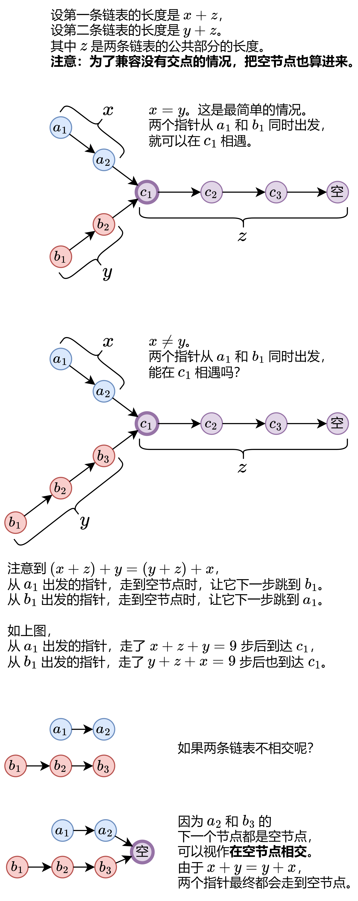

### 相交链表

具体算法如下：

初始化两个指针 p=headA, q=headB。
不断循环，直到 p=q。
每次循环，p 和 q 各向后走一步。具体来说，如果 p 不是空节点，那么更新 p 为 p.next，否则更新 p 为 headB；如果 q 不是空节点，那么更新 q 为 q.next，否则更新 q 为 headA。
循环结束时，如果两条链表相交，那么此时 p 和 q 都在相交的起始节点处，返回 p；如果两条链表不相交，那么 p 和 q 都走到空节点，所以也可以返回 p，即空节点。
