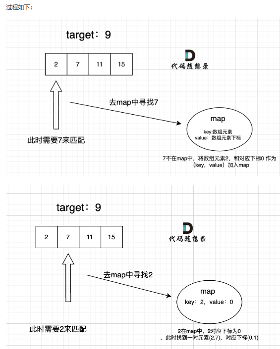

首先再强调一下 什么时候使用哈希法，当我们需要查询一个元素是否出现过，或者一个元素是否在集合里的时候，就要第一时间想到哈希法。

本题呢，我就需要一个集合来存放我们遍历过的元素，然后在遍历数组的时候去询问这个集合，某元素是否遍历过，也就是 是否出现在这个集合。

那么我们就应该想到使用哈希法了。

因为本题，我们不仅要知道元素有没有遍历过，还要知道这个元素对应的下标，需要使用 key value结构来存放，key来存元素，value来存下标，那么使用map正合适。

再来看一下使用数组和set来做哈希法的局限。

- 数组的大小是受限制的，而且如果元素很少，而哈希值太大会造成内存空间的浪费。
- set是一个集合，里面放的元素只能是一个key，而两数之和这道题目，不仅要判断y是否存在而且还要记录y的下标位置，因为要返回x 和 y的下标。所以set 也不能用。
此时就要选择另一种数据结构：map ，map是一种key value的存储结构，可以用key保存数值，用value再保存数值所在的下标。

 
同理，std::map 和std::multimap 的key也是有序的（这个问题也经常作为面试题，考察对语言容器底层的理解）。 
**这道题目中并不需要key有序，选择std::unordered_map 效率更高！**
过程如下：
